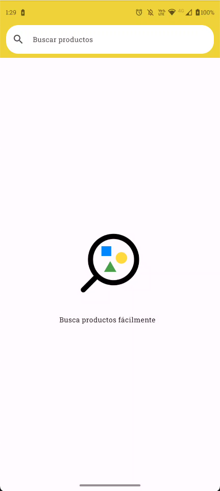
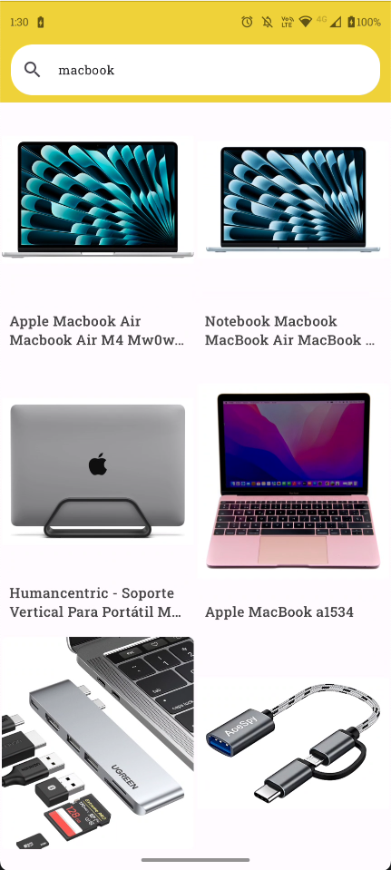
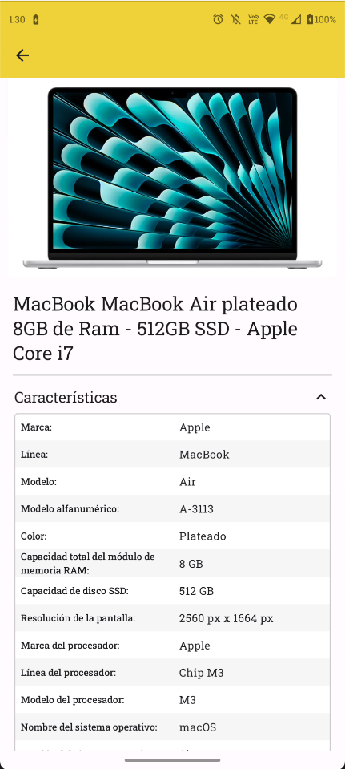

<div align="center"> 

<br></br>
<h1>Product Search App (Android)</h1> 
<p>Android challenge solution for searching products using the <a href="https://developers.mercadolibre.com.ar/es_ar/buscador-de-productos">Mercado Libre API</a>.</p> 
</div>


## 📱 The challenge

Create an app that allows search and visualization of products

## 🏗 Architecture & Module Structure
Followed a modular Clean-Architecture style

- **app** (Android app)
  Hosts the NavHost, sets up Koin, ties modules together.

- **core**

    - **data** (Android library)
      Retrofit API, repository implementations.

      *On a bigger project, **:network** and **:domain** modules could be extracted*
    - **ui** (Android library) Common UI components.

- **features** Screen UIs, ViewModels, Koin modules for each feature.
    - **search**
    - **product-details**

### DataFlow
```
[UI] <--> [ViewModel] <--> [Repository] <--> [API/Database]
```

## 🔧 Technologies and tools
- **Retrofit** for Network calls
- **Jetpack Compose** to build the UI
- **Koin** for dependency injection
- **Paging 3** to handle large volume of data and provide a smooth UX
- **Unit Tests** for the ViewModels
- **UI Testing** with Compose
- **Kotlin Flows** for reactiveness
- **MVVM** architecture
- **Detekt** for code quality

## 📽️ Screenshots

|Search init|Search with results|Product details|
|---|---|---|
||||

&nbsp;

**[Video Demo](https://drive.google.com/file/d/1Dw-eoLLfol2EuGbxs3IxViEyXlj81ItW/view?usp=sharing)**

&nbsp;

## 🏁 Getting Started

1. Clone the repo and open in Android Studio
2. Add your AUTH_TOKEN in `RetrofitBuilder`

<br>

-----
<br>

Crafted with ❤️ and Kotlin.
